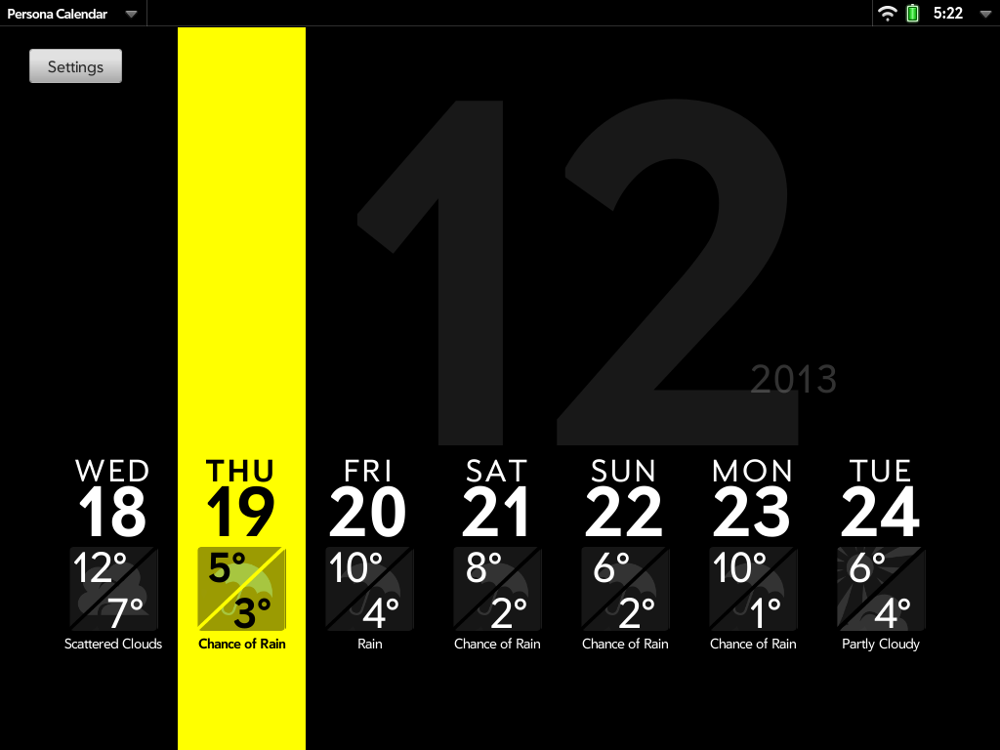

This is a small project I did in my spare time to make a calendar for the HP Touchpad that looks a bit like the one shown in Persona 4.

You can tap the screen to get more information on the weather - high/low temperatures and the description. (Sorry, Celsius only for now.)

From this screen, you can also press the 'Settings' button to change the location the weather is given for.

Download
--------

There are various ways to download the app, ordered from easiest to hardest...

* <del>From the [HP App Catalog](http://developer.palm.com/appredirect/?packageid=uk.me.gm.personacal&applicationid=1005684)</del> - RIP HP App Catalog
* From [Preware](http://www.preware.org/) - search for 'Persona Calendar'
* From WebOS Nation - see [here](http://www.webosnation.com/persona-calendar)

Setup Instructions
------------------

The app is designed to be used with the Touchpad's Exhibition mode. Once it has been installed, go to 'Exhibition' in the 'Settings' tab and check 'Persona Calendar'.

The app gets its weather information from [Weather Underground](http://www.wunderground.com/).

You'll need to register with them to get your own Weather Underground API key to use the app. See [here](http://www.wunderground.com/weather/api/) for details.

Enter your API key and select your location from the Settings screen.

Source & License
----------------

The source code is available on GitHub here: [https://github.com/gerjomarty/personacal](https://github.com/gerjomarty/personacal)

The code is licensed under the MIT license.
